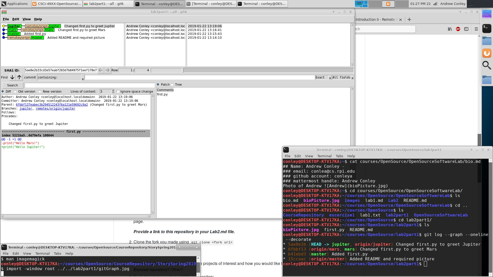
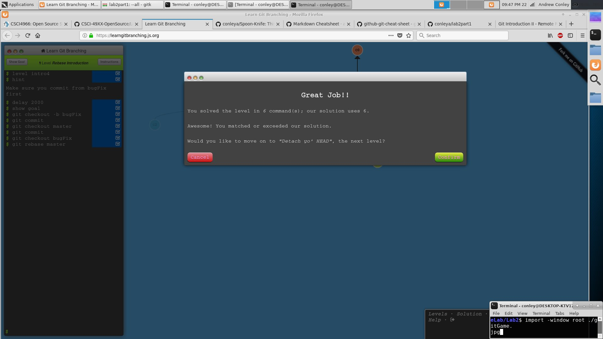

Git graph diagram:

Fork example:

[Fork](https://github.com/conleya/Spoon-Knife)

Basics of Git Branching:

Pull Request Demo:

[Pull Request](https://github.com/conleya/PullReq)

courseproject Repository:

[https://github.com/conleya/courseproject](https://github.com/conleya/courseproject)

Project Ideas Table Repository:

[https://github.com/sringram96/ProjectIdeas2019](https://github.com/sringram96/ProjectIdeas2019)
